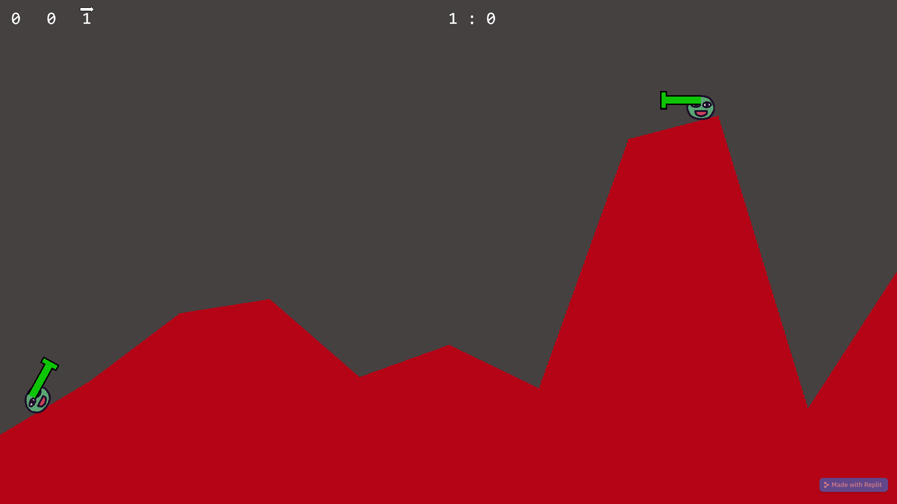

# 1.3 Research

## ShellShock Live

.png>)

### Overview

ShellShock Live is an online multiplayer free-to-play strategy game made and published by kChamp games, where players try to destroy eachothers' tanks to win the game by aiming the turrets at the correct angle with the right amount of power to hit them.

### Aspect 1 (of 2-4 aspects per solution?)

A simple online multiplayer game which can have 2 players concurrently

### Features



| Feature             | Justification                               |
| ------------------- | ------------------------------------------- |
| Feature description | Some reason it's a good fit in this project |



| Feature             | Justification                                              |
| ------------------- | ---------------------------------------------------------- |
| Feature description | Reason it's beyond the scope/not suitable for this project |


