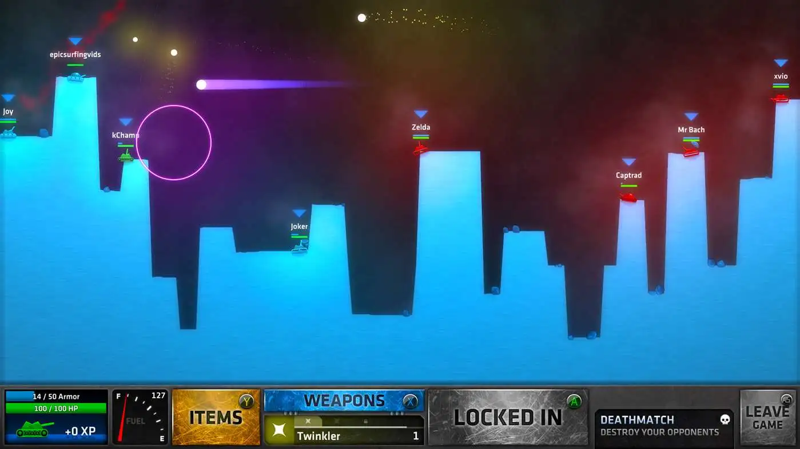

# 1.4a Features of Proposed Solution

## Gameplay

### Controls

My aim is to make the controls very simple, easy to learn and feel natural, so the player can concentrate on the gameplay without struggling to control their character.&#x20;

<figure><figcaption>
Arrow keys on the keyboard will be used
</figcaption></figure>

The arrow keys will be used for the tank game, with up and down to adjust the power, and left and right arrows controlling the angle of the shot, as these are what feel natural to most players. The spacebar will be used to fire a round at the enemy.&#x20;

### Varying wind

To avoid the game feeling too repetitive, between each player's shot, there will be a change in the wind to make the player have to adjust their shot according to the environment. This means that there is enough variation in the level to keep it feeling new.

### Level Design

The levels can be randomly generated to create a new terrain each time it is played, using perlin noise for example. This will keep the game fresh for the player as it is different each time they play. Using perlin noise apposed to using complete random functions is better for terrain as it produces a smooth gradient.&#x20;

<figure><figcaption>
Random Perlin noise generation which can be mapped to levels to create randomized terrain
</figcaption></figure>

 

<figure><figcaption>
A graph of perlin noise and how terrain generated from it would look
</figcaption></figure>

### Physics

The game will have physics acting on the bullets so they are affected by gravity and each player must use this to aim the tanks' turrets at the correct angle and power so the bullet hits the enemies' tanks. This adds an element of skill to the game which the players will need to master in order to win more.

### Multiplayer

The main premise of the game is to have 2 people playing against each other in a turn-based action so multiplayer is necessary to handle multiple players and connect them to the same game. This can be done in javascript using sockets to connect the players to the same lobbies.&#x20;

## User Interface

<figure><figcaption>
The ShellShock Live User Interface
</figcaption></figure>

The User Interface in my game will be similar to ShellShock Live but more primitive, displaying the most important information about your tank at the bottom of the screen, such as health and ammo, but simplifying it by removing the other unnecessary elements which won't be in my game such as items, fuel and armor.

### Main Menu

A simple main menu will be added to the game where the player can navigate to main features such as joining and creating a game lobby.

## Limitations

### Graphics

Due to time limitations, graphics will not be the main focus of the game and they will be kept very basic with not much model design or image effects present.

### Story/Campaign

There will be no story to the game, as the main gamemode is a multiplayer PvP, leaving no time to implement a campaign in my game.

### Dedicated servers

There won't be any dedicated server hosting for the online multiplayer features of the game. Players need to host their own games and have the second player connect directly to that lobby for the multiplayer.&#x20;
